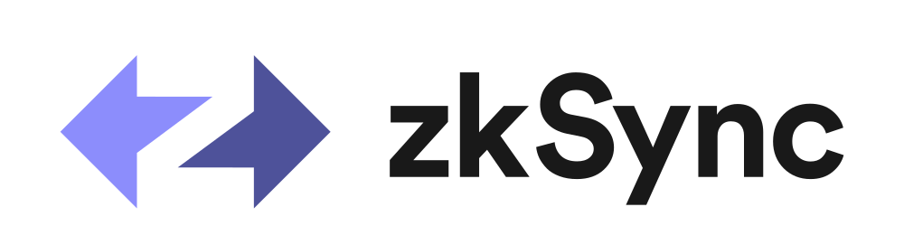

# zkSync: scaling and privacy engine for Ethereum

zkSync is a scaling and privacy engine for Ethereum. Its current functionality scope includes low gas transfers of ETH and ERC20 tokens in the Ethereum network.

## Description

zkSync is built on ZK Rollup architecture. ZK Rollup is an L2 scaling solution in which all funds are held by a smart contract on the mainchain, while computation and storage are performed off-chain. For every Rollup block, a state transition zero-knowledge proof (SNARK) is generated and verified by the mainchain contract. This SNARK includes the proof of the validity of every single transaction in the Rollup block. Additionally, the public data update for every block is published over the mainchain network in the cheap calldata.

This architecture provides the following guarantees:

- The Rollup validator(s) can never corrupt the state or steal funds (unlike Sidechains).
- Users can always retrieve the funds from the Rollup even if validator(s) stop cooperating because the data is available (unlike Plasma).
- Thanks to validity proofs, neither users nor a single other trusted party needs to be online to monitor Rollup blocks in order to prevent fraud.

In other words, ZK Rollup strictly inherits the security guarantees of the underlying L1.

To learn how to use zkSync, please refer to the [zkSync SDK documentation](https://zksync.io).

## Development Documentation

The following guides for developers are available:

- Installing development dependencies: [docs/setup-dev.md](docs/setup-dev.md).
- Launching zkSync locally: [docs/launch.md](docs/launch.md).
- Development guide: [docs/development.md](docs/development.md).
- Repository architecture overview: [docs/architecture.md](docs/architecture.md).

## Projects

- [zkSync server](core/bin/server)
- [zkSync prover](core/bin/prover)
- [zkSync explorer](infrastructure/explorer)
- [JavaScript SDK](sdk/zksync.js)
- [Rust SDK](sdk/zksync-rs)

## License

zkSync is distributed under the terms of both the MIT license
and the Apache License (Version 2.0).

See [LICENSE-APACHE](LICENSE-APACHE), [LICENSE-MIT](LICENSE-MIT) for details.
