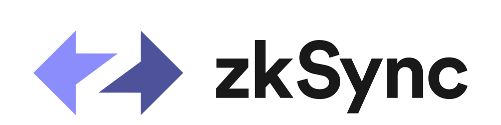

# zkSync: Scaling and Privacy Engine for Ethereum

[-4CAF50?style=flat-square)](https://rinkeby.zksync.io)
[-FF9800?style=flat-square)](https://ropsten.zksync.io)

zkSync is a **Layer 2 scaling and privacy solution** for Ethereum, utilizing **Zero-Knowledge Rollup (ZK-Rollup)** technology. It currently supports low-gas transfers of ETH and ERC20 tokens on the Ethereum network.

---

## ⚙️ How ZK-Rollup Works (Architecture)

zkSync is built upon the ZK-Rollup architecture. This Layer 2 solution operates as follows:

1.  **Funds are Secured on L1:** All assets are held securely by a smart contract residing on the Ethereum mainchain (L1).
2.  **Off-Chain Computation:** Computation and storage are executed entirely off-chain.
3.  **On-Chain Validation:** For every Rollup block, a **Zero-Knowledge Proof (SNARK)** of the state transition's validity is generated. This proof confirms the legitimacy of every single transaction within the block.
4.  **Data Availability:** The public data necessary to update the state is published back to the mainchain using cheap $\text{calldata}$.

### Core Security Guarantees

This architecture strictly **inherits the security guarantees of the underlying L1** and provides three crucial assurances:

* **Integrity:** The Rollup validator(s) **can never corrupt the state or steal funds** (a significant advantage over Sidechains).
* **Availability:** Users can **always retrieve their funds** from the Rollup, even if validators stop cooperating, because all transaction data is publicly available on L1 (solving the data availability problem of Plasma).
* **Trustlessness:** Due to the cryptographic validity proofs, neither users nor any other trusted third party needs to be online to monitor Rollup blocks to prevent fraud. **The security is mathematically guaranteed.**

---

## 📚 Documentation and Getting Started

To begin using zkSync, please refer to the official documentation:

* **SDK Usage:** Learn how to integrate with zkSync using the comprehensive [zkSync SDK documentation](https://zksync.io/api/sdk/).

### Developer Guides

Detailed guides are available for setting up and contributing to the project:

* **Setup:** Installing development dependencies: [`docs/setup-dev.md`](docs/setup-dev.md).
* **Local Launch:** Launching zkSync locally: [`docs/launch.md`](docs/launch.md).
* **Development:** Comprehensive development guide: [`docs/development.md`](docs/development.md).
* **Architecture:** Repository architecture overview: [`docs/architecture.md`](docs/architecture.md).

---

## 🧱 Repository Structure and Key Components

This repository is divided into several main components:

| Component | Description | Location |
| :--- | :--- | :--- |
| **zkSync Server** | The core service handling transactions, sequencing, and state management. | `core/bin/server` |
| **zkSync Prover** | Generates the Zero-Knowledge (SNARK) proofs for block validity. | `core/bin/prover` |
| **JavaScript SDK** | Frontend and backend library for interacting with the zkSync network. | `sdk/zksync.js` |
| **Rust SDK** | Native library for robust integration and performance-critical applications. | `sdk/zksync-rs` |

---

## 📝 Changelog

Due to the size and modular nature of the repository, the changelog is split across major components for easier tracking:

* **Smart Contracts:** [`changelog/contracts.md`](changelog/contracts.md)
* **Core Logic:** [`changelog/core.md`](changelog/core.md)
* **Infrastructure:** [`changelog/infrastructure.md`](changelog/infrastructure.md)
* **JavaScript SDK:** [`changelog/js-sdk.md`](changelog/js-sdk.md)
* **Rust SDK:** [`changelog/rust-sdk.md`](changelog/rust-sdk.md)

---

## ⚖️ License

zkSync is **Dual-Licensed**. It is distributed under the terms of both the **MIT License** and the **Apache License (Version 2.0)**.

See [`LICENSE-APACHE`](LICENSE-APACHE) and [`LICENSE-MIT`](LICENSE-MIT) for full details.
