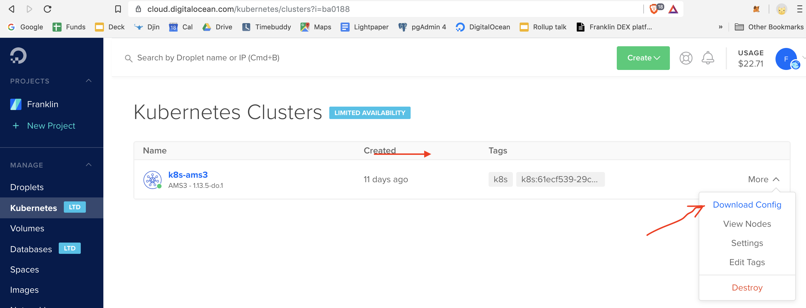

## Connect the cluster

Go to Digital Ocean Dashboard > Kubernetes Clusters > {Your Cluster} > More > Download Config 
https://cloud.digitalocean.com/kubernetes/clusters?i=ba0188



Save it to `etc/kube/kubeconfig.yaml`

For convenience of testing, add `export KUBECONFIG=/path/to/etc/kube/kubeconfig.yaml` to `~/.bash_profile`

Now you can check your setup:

```
kubectl config view
```

## Deploy

### Manually

Activate env with `zksync <TARGET_ENV>`

Only if verifier or circuit changes:
1. See README.md about developing circuit and updating verifying keys

Only if deploying new contract or fresh depoyment:
1. `zksync build-contracts`
2. `zksync db-reset || zksync db-setup`
3. `zksync genesis`
4. `zksync redeploy` (OR `zksync init-deploy` on fresh deploy)

Update node:
5. `zksync update-rust`
6. `zksync update-nginx`
7. `zksync restart`
